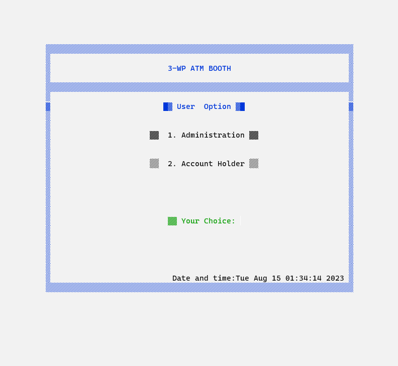
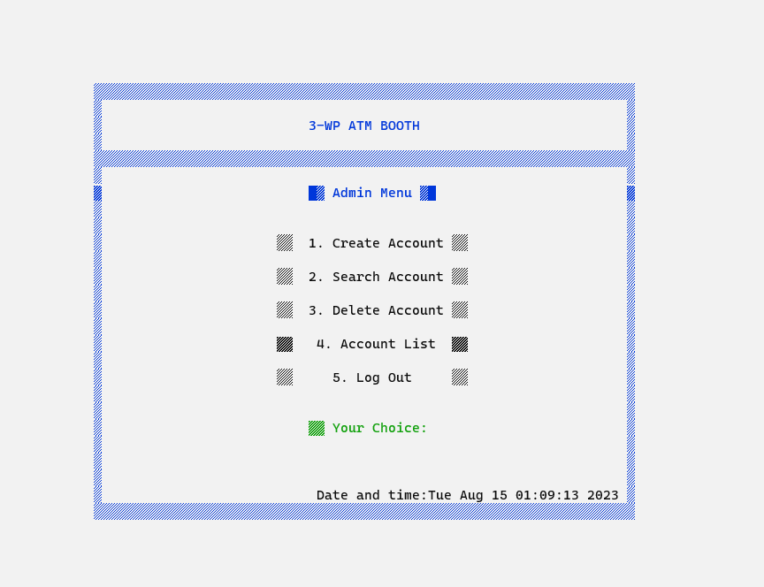
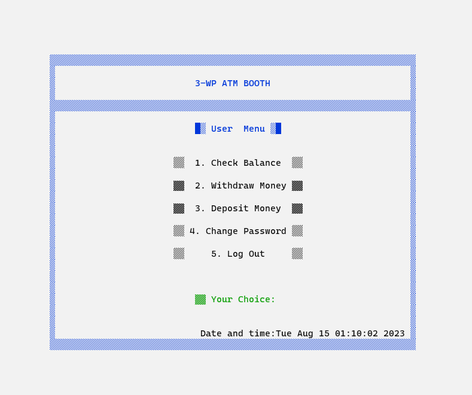

# ***ATM-Management-System***
A small project for the **Software Development-I** course developed in **C** programming language. And used file system to store the data.

## The software has 2 different types of user:  
**i. Administration**
 
**ii. Account Holder**
 
#
### This is the first page of our software where we've **2 main options** : 

#
### After entering password protecting adminstration menu using **correct username and password**. This is the adminstration's interface :

#
### After entering password protecting account holder menu using **correct username and password**. This is the account holder's interface :

#